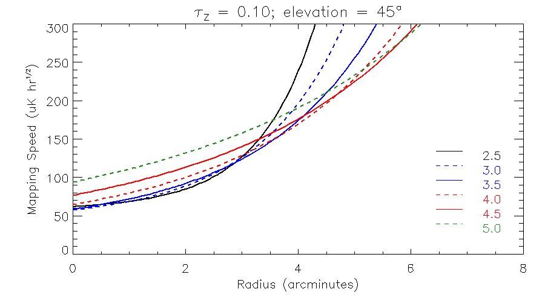
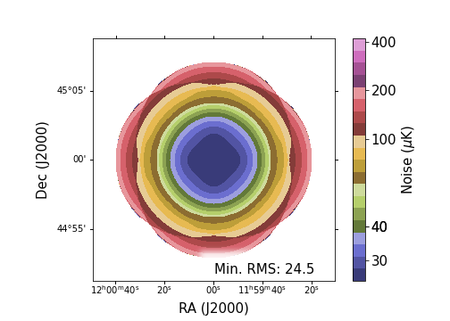

      
# Summary

MUSTANG-2 is a 215-detector array that was installed on the 100-m Robert C. Byrd Green Bank Telescope (GBT) in 2016. Observing at 90 GHz, with a continuum bandpass between 75 and 105 GHz, it achieves $10^{\prime\prime}$ resolution (FWHM) and has an instantaneous field of view (FOV) of $4^{\prime}.2$. The primary observing strategy employed for MUSTANG-2 observations is on-the-fly mapping with a Lissajous daisy pattern sufficiently large to go off-source. A fundamental reasons for this strategy is due to the data processing, which is itself a differencing measurement. In this research note, we provide some light-weight tools that may be useful for proposers of MUSTANG-2.
    
# Statement of need

MUSTANG-2 is a continuum camera operating on the GBT for which
mapping speeds have disseminated primarily as a single number calculated as the RMS within the central 2 arcminutes of a Lissajous daisy scan. However, MUSTANG-2 proposers may wish to obtain results outside of this range and potentially combine multiple scan pointings. Additionally, MUSTANG-2 has a published transfer function [@romero:2020], but this has largely not be incorporated into the technical justification of MUSTANG-2 proposals. This package provides a lightweight set of tools that allow MUSTANG-2 proposers to incorporate more advanced sensitivity maps and signal transmittance into their technical justifications.

{ width=80% }

{ width=80% }

Given the prevalence of projects which wish to observe galaxy clusters via the Sunyaev-Zel'dovich [SZ; @sunyaev:1972] effect, we have included the ability to estimate the SZ effect from a spherical cluster which uses an universal pressure profile (UPP) as parameterized in [A10; @arnaud:2010]. However, users may also supply their own (unfiltered) sky images. 

Additionally, one can obtain maps of filtered signal (arbitrary units). Instructions for users to convert images from units of Compton $y$, Jy/pixel, or Jy/beam (per MUSTANG-2 beam) are provided in the documentation. While there is some built-in functionality for making figures, users may prefer to access the generated fits files independently. In this manner, users can identify regions or features of interest and determine the required sensitivity to detect those regions. 
    
Due to the filtering of extended signal, MUSTANG-2 observers may want to forward model objects which have extended signal. Another example notebook shows how this may be done for the case of a spherical cluster. So long as a user can supply a parametric model, the same methodology can be applied to any target. Here, we wish to stress once again that the tools provided in this package are approximate and should only serve to guide in crafting the technical justification in MUSTANG-2 proposals. For actual MUSTANG-2 data, transfer functions and other project-specific MUSTANG-2 data products will be provided to observers.

Finally, we note that this package is based on MUSTANG-2 data products from the MIDAS pipeline \citep{romero2020}. There is an alternative data processing suite, Minkasi [@romero:2020; @dicker:2020,@orlowski:2022] which allows one to fit models to data in the time domain, which is how raw MUSTANG-2 data is recorded. This data processing suite has the advantage to better recover large-scale signal, but comes with added complexity. It is thus currently not ready for public distribution.

# Extension: WIKID

We include options to simulate observations with a potential successor to MUSTANG-2, WIKID [@dicker:2023]. WIKID is proposed to be a single band continuum camera with polarization capabilities and a field of view just over $8^{\prime}$. Mapping speed profiles and approximate transfer functions are derived using real MUSTANG-2 data and simulating observations, within MIDAS, for a WIKID array of detectors with improved detector sensitivity and reduced readout noise. For an example cluster at $z=0.5$ with $M_{500} = 6 \times 10^{14}$ M$_{\odot}$ ($R_{500} = 3^{\prime}$), we find that with WIKID we can obtain uncertainties which are less than half those obtained from analogous MUSTANG-2 observations with twice the exposure of the WIKID observations. 

# Acknowledgements

This project uses the following Python packages: Astropy [@astropy], NumPy [@numpy2011; @numpy2020]

# References